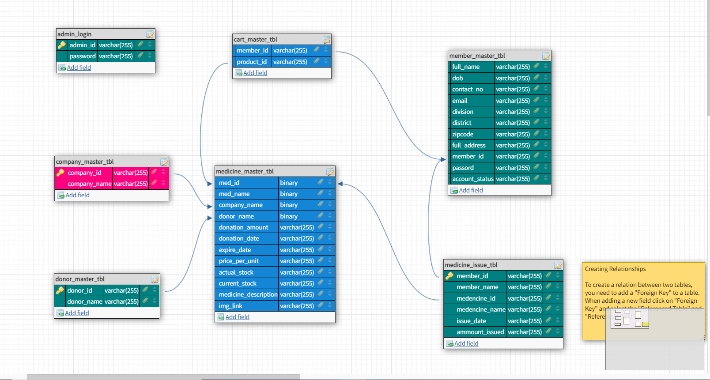
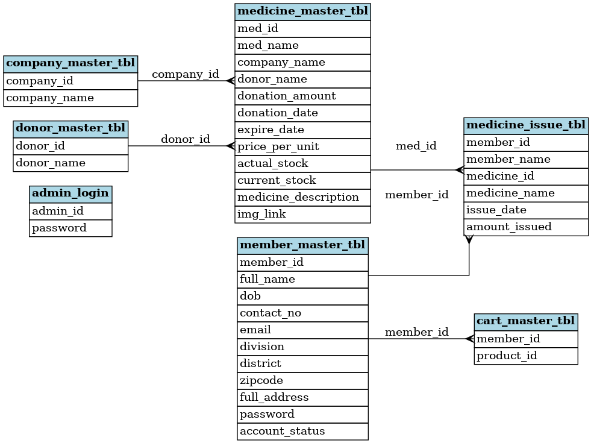

# 🛢️ Database Design Project  

This database is a part of my **Free Medicine Donation Website**. It aims to collect unused medicines from individuals, accept donations from donors, and distribute these medicines to underprivileged individuals who cannot afford expensive treatments. The platform leverages modern web technologies for efficient management and accessibility.  

  

---

## 📜 Table of Contents  
1. [📖 Introduction](#introduction)  
2. [✨ Features](#features)  
3. [📊 ER Diagram](#er-diagram)  
4. [🗂️ Database Schema](#database-schema)  
5. [💻 Technologies Used](#technologies-used)  
6. [⚙️ Setup Instructions](#setup-instructions)  
7. [📷 Screenshots](#screenshots)  
8. [🤝 Contributors](#contributors)  
9. [📚 References](#references)  

---  

## 📖 Introduction  
Unused medicines can save lives if managed effectively. This platform bridges the gap between surplus medicines and individuals in need. Through collaboration with donors, NGOs, and users, the system promotes a circular solution for medicine usage.  

---  

## ✨ Features  
- **Admin Panel**: Manage users, donors, and medicines.  
- **User Module**: Registration, login, and medicine requests.  
- **Donor Module**: Registration and donation logging.  
- **Medicine Tracking**: Maintain stock, manage issues, and provide detailed descriptions.  
- **Secure Login**: Separate portals for admins, donors, and users.  

---  

## 📊 ER Diagram  
The following diagram represents the relationships between the entities in the database.  

  

---  

## 🗂️ Database Schema  
The project uses a **Microsoft SQL Server database**. Below is the schema design:  

---  

## 💻 Technologies Used  
- **Front End**: HTML, CSS, Bootstrap 4, JavaScript  
- **Back End**: C#, ASP.NET, .NET Framework  
- **Database**: Microsoft SQL Server  
- **Code Editor**: Visual Studio 2022  

---  

## ⚙️ Setup Instructions  
1. Clone the repository.  
2. Set up Microsoft SQL Server and import the provided database schema from the 'database_creation' folder.  
3. Run the files to initialize the database.  
4. Use stored procedures to perform **CRUD (Create, Read, Update, Delete)** operations.  

---  
